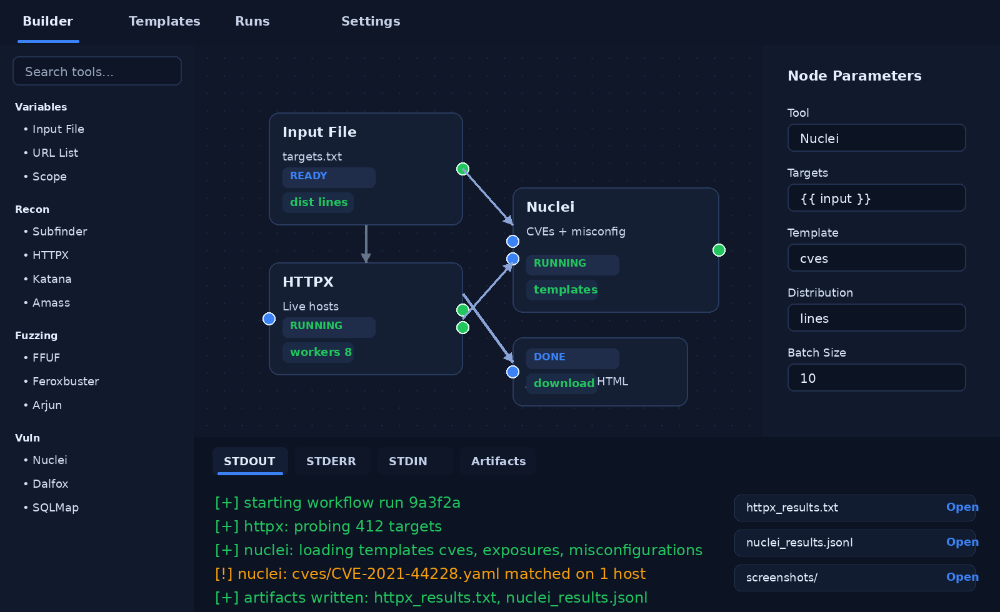

# mini-tricky

<p align="center">
  
</p>

<p align="center">
  <strong>Local-first, Electron-based visual workflow builder for bug bounty hunting and offensive security automation.</strong>
  <br />
  Inspired by Trickest-style workflow UX, but designed to run entirely on your own machine with locally installed tools.
</p>

<p align="center">
  <a href="#features">Features</a> •
  <a href="#architecture">Architecture</a> •
  <a href="#quick-start">Quick Start</a> •
  <a href="#workflows">Workflows</a> •
  <a href="#roadmap">Roadmap</a>
</p>

<p align="center">
  
  
  
  
  
</p>

---

## What this is

**mini-tricky** is a local desktop application for building and running offensive-security workflows with a **drag-and-drop DAG editor**.

Think:
- **Trickest-style workflow builder**
- **Electron desktop shell**
- **FastAPI execution backend**
- **React/React Flow UI**
- **Local binaries installed on your host**

The goal is simple: stop juggling shell history, bash spaghetti, and 30 half-connected recon tools. Build reusable workflows visually, run them locally, stream logs live, and keep artifacts organized per node.

---

## Why it exists

Most bug bounty setups degrade into one of these:
- a pile of one-off bash scripts
- terminal tabs breeding like rabbits
- notes scattered across files and clipboard history
- no clean way to model dependencies or reuse workflows

mini-tricky fixes that by giving you:
- **visual node-based workflow composition**
- **typed sockets and explicit data flow**
- **parallel and serial execution modes**
- **per-node logs and downloadable artifacts**
- **local-first execution with no cloud dependency**

In plain English: less chaos, more motor.

---

## Features

### Visual workflow builder
- Drag tools and variables onto a central graph canvas
- Connect nodes using **typed input/output sockets**
- Prevent invalid graph connections such as input→input or output→output
- Bind upstream outputs to downstream parameters explicitly

### Trickest-style execution model
- DAG-based execution engine
- Parent nodes must complete before child nodes start
- Supports both:
  - **single-path / serial execution**
  - **parallel execution** where independent nodes can run concurrently
- Failed upstream nodes can block downstream execution cleanly

### Distribution / fan-out
- Node-level distribution support
- Split work by:
  - lines
  - files
  - file batches
- Useful for feeding large target lists into tools like `httpx`, `nuclei`, `ffuf`, `katana`, etc.

### Desktop-native ergonomics
- Electron shell for local app experience
- Open artifacts directly from the UI
- Pick local input files without playing browser sandbox games
- Tool status checks against local `PATH`

### Per-node execution visibility
- Bottom console dock with tabs for:
  - `stdout`
  - `stderr`
  - `stdin`
  - artifacts/downloads
- Live log streaming during workflow execution
- Better feedback than “something happened somewhere maybe”

### Bug bounty oriented tooling model
Designed around locally installed tools such as:
- `subfinder`
- `assetfinder`
- `amass`
- `httpx`
- `naabu`
- `katana`
- `gau`
- `waybackurls`
- `ffuf`
- `feroxbuster`
- `nuclei`
- `dalfox`
- `sqlmap`
- `gospider`
- `arjun`

---

## Screenshots

### Workflow builder during execution

<p align="center">
  
</p>

### Local architecture overview

<p align="center">
  
</p>

---

## Architecture

mini-tricky is built around a simple rule:

> **The UI draws the graph. The backend validates and executes the graph. The host machine owns the tools.**

### Core pieces
- **Electron**
  - desktop shell
  - process management
  - local file handling
  - IPC bridge for safe desktop actions
- **React + React Flow**
  - workflow editor
  - tool palette
  - argument pane
  - run console
- **FastAPI backend**
  - graph validation
  - run scheduling
  - workflow execution
  - log streaming
  - artifact handling
- **Local binaries**
  - actual security tools installed on the host
  - launched by the backend as subprocesses

### Execution semantics
- each workflow is treated as a **DAG**
- nodes only run when their dependencies are satisfied
- sockets are validated before execution
- independent nodes may run in parallel when allowed
- downstream nodes receive structured outputs from upstream nodes

---

## UI layout

The target layout is intentionally familiar:

- **Top navigation bar**
  - Builder
  - Templates
  - Runs
  - Settings
- **Left sidebar**
  - search bar
  - variable types
  - tool library grouped by category
- **Center**
  - workflow graph canvas
- **Right sidebar**
  - argument editor
  - switches / toggles
  - distribution settings
- **Bottom dock**
  - `stdout`
  - `stderr`
  - `stdin`
  - artifacts/downloads

Basically: Trickest DNA, but local.

---

## Quick Start

> This assumes you are running the local desktop version and have the required tools installed on your host.

### 1. Clone the repository

```bash
git clone https://github.com/MKlolbullen/mini-tricky.git
cd mini-tricky
```

### 2. Install Node dependencies

```bash
npm install
```

If the frontend lives in its own folder, install there too:

```bash
cd bug-bounty-platform
npm install
cd ..
```

### 3. Install Python backend dependencies

```bash
cd backend
python3 -m venv .venv
source .venv/bin/activate
pip install -r requirements.txt
cd ..
```

### 4. Run the desktop app in development mode

```bash
npm run desktop:dev
```

### 5. Build the desktop app

```bash
npm run desktop:build
```

---

## Example workflows

### Basic recon chain
```text
Input Domain -> Subfinder -> HTTPX -> Nuclei -> Output
```

### URL discovery + fuzzing
```text
Input Domain -> Gau/Katana -> Deduplicate -> FFUF/Feroxbuster -> Output
```

### JS endpoint and secrets hunting
```text
Input Domain -> Katana/Gospider -> JS Collector -> SecretFinder/LinkFinder -> Output
```

### Parameter discovery into testing
```text
Input URL List -> Arjun -> Param Filter -> Dalfox / SQLMap -> Output
```

---

## Design goals

- **local-first**
- **fast iteration**
- **transparent execution**
- **composable workflows**
- **host-controlled tooling**
- **no fake cloud dependency for basic automation**

This is meant to be useful for:
- bug bounty hunters
- offensive security specialists
- web/API testers
- researchers building repeatable recon pipelines

---

## Suggested repository structure

```text
mini-tricky/
├── electron/               # Electron main + preload
├── backend/                # FastAPI backend and scheduler
├── bug-bounty-platform/    # React/React Flow frontend
├── docs/
│   └── images/             # README screenshots / diagrams
├── scripts/                # dev/build helpers
├── tools.yaml              # tool registry / metadata
└── README.md
```

---

## Roadmap

### Near term
- typed node sockets and better graph validation
- replay/resume single node runs
- cached upstream artifacts
- richer run history and artifact explorer
- native desktop notifications

### Medium term
- per-tool install/bootstrap manager
- environment profiles
- reusable workflow templates
- better result normalization across tools
- integrated preview for text, JSON, HTML, and screenshots

### Longer term
- playbooks for multi-stage bug bounty workflows
- AI-assisted workflow generation and artifact triage
- richer evidence graphing
- optional report export pipelines

---

## Non-goals

To be very clear, mini-tricky is **not** trying to be:
- a cloud SaaS clone
- a magic “one-click pwn everything” box
- a replacement for understanding how the tools actually work

It is a **workflow engine and local operator UI**, not wizard dust.

---

## Security / operational note

This project is intended for:
- authorized testing
- lab environments
- bug bounty programs where you are allowed to test
- defensive research and security engineering

Do not aim this at targets you do not have permission to assess.

---

## Contributing

PRs, issues, and brutally honest feedback are welcome.

Good contribution areas:
- node execution engine
- typed tool schemas
- React Flow UX improvements
- artifact rendering
- Electron desktop ergonomics
- local tool bootstrap/install logic

---

## License

MIT

---

## Acknowledgments

- **Trickest** for the workflow-builder inspiration
- **ProjectDiscovery** and the wider offensive security tool ecosystem
- **React Flow / XYFlow** for the graph foundation
- everyone who got tired of terminal chaos and decided to build a better operator surface

---

<p align="center">
  Built for local workflows, real tooling, and less operational mess.
</p>
