<h1 align="center">
  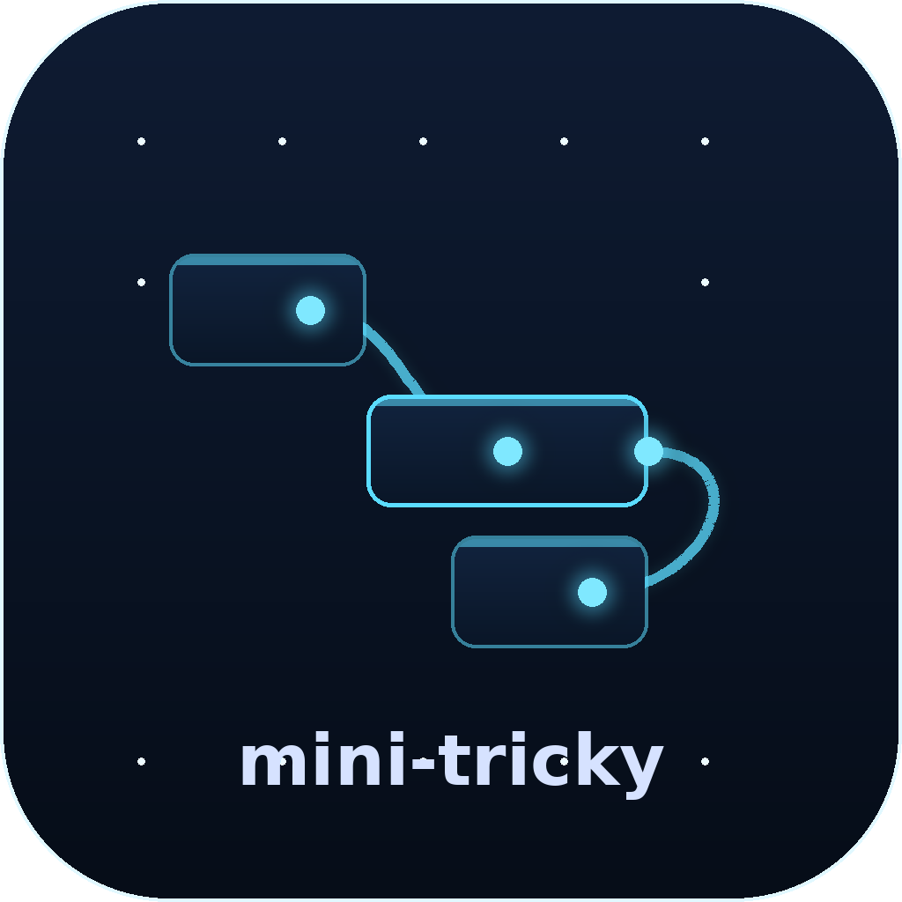
  <br />
  mini-tricky
</h1>

<p align="center">
  <strong>Local-first visual workflow automation for authorized offensive security.</strong>
  <br />
  Build typed recon, web, API, cloud, network, and analysis pipelines as runnable DAGs — without turning your terminal history into an archaeological site.
</p>

<p align="center">
  <a href="https://github.com/MKlolbullen/mini-tricky/actions/workflows/ci.yml"></a>
  <a href="https://github.com/MKlolbullen/mini-tricky/releases"></a>
  
  
  
  <a href="LICENSE"></a>
</p>

<p align="center">
  <a href="#download">Download</a> ·
  <a href="#quick-start">Quick start</a> ·
  <a href="#what-you-can-build">Workflows</a> ·
  <a href="#architecture">Architecture</a> ·
  <a href="#security-model">Security</a> ·
  <a href="#development">Development</a>
</p>

---

<p align="center">
  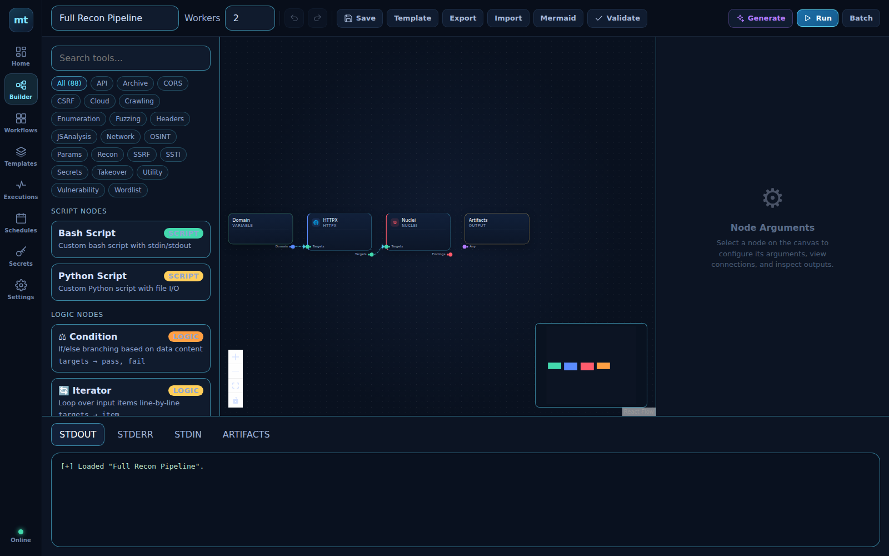
  <br />
  <em>Drag tools and logic nodes onto the canvas, connect typed sockets, configure real CLI flags, and execute the graph locally.</em>
</p>

## Why mini-tricky?

Bug-bounty and pentest automation usually starts clean and ends as twenty terminal tabs, six half-related Bash scripts, duplicated output files, and one command nobody wants to admit they no longer understand.

mini-tricky gives those pipelines an explicit model:

- **visual DAGs** instead of implicit shell ordering;
- **typed sockets** instead of hoping one tool's output happens to match another tool's input;
- **parallel execution** for independent branches;
- **per-node artifacts and logs** instead of one giant stdout soup;
- **versioned workflows, templates, scheduling, and replay** instead of copy/paste archaeology;
- **local execution** with no mini-tricky cloud account or subscription required.

The core application is local-first. Individual security tools, OSINT providers, package managers, LLM integrations, or workflows may of course make network requests when you configure them to do so.

## At a glance

- **<!-- tools-count -->148<!-- /tools-count --> integrated security tools** defined as typed tool specifications.
- **<!-- templates-count -->55<!-- /templates-count --> built-in workflow templates** spanning recon, web application testing, APIs, cloud, secrets, injection, takeover, source review, and more.
- **21+ tool categories** plus purpose-built logic/source nodes.
- **Electron desktop app** for macOS, Windows, and Linux, plus browser-only development/web mode.
- **FastAPI + WebSocket execution engine** with live node state and logs.
- **React + React Flow** canvas with typed, color-coded connections.
- **SQLite + Alembic** persistence for workflows, runs, profiles, presets, and versions.
- **OS-keychain-backed secrets** through Python `keyring` with a restricted local fallback.
- **Mermaid ⇄ workflow conversion** for documentation and graph interchange.
- **Optional AI workflow generation** with a non-AI fallback when no provider key is configured.

Current release metadata: `<!-- release-version -->0.4.0-beta<!-- /release-version -->`.

> Catalog counts and release metadata are synchronized from source files. Run `python scripts/sync_project_metadata.py --write` after changing tools, templates, or release metadata; CI checks for drift.

## Guided tour

<table>
  <tr>
    <td width="50%" valign="top">
      <h3 align="center">Workflow builder</h3>
      
      <p align="center"><sub>Typed React Flow graph with tools, sources, logic, modules, and outputs.</sub></p>
    </td>
    <td width="50%" valign="top">
      <h3 align="center">Node inspector</h3>
      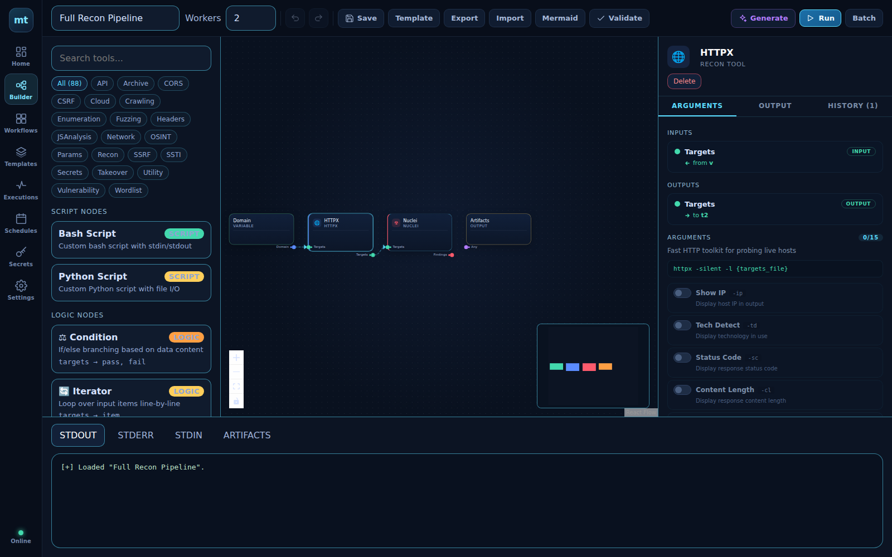
      <p align="center"><sub>Real CLI arguments exposed as typed controls with a live command preview.</sub></p>
    </td>
  </tr>
  <tr>
    <td width="50%" valign="top">
      <h3 align="center">Live execution</h3>
      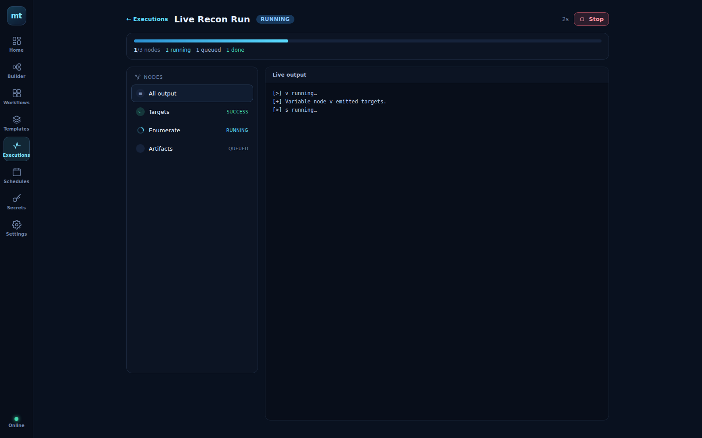
      <p align="center"><sub>Queued → running → success/failed state, per-node output, cancellation, and replay.</sub></p>
    </td>
    <td width="50%" valign="top">
      <h3 align="center">Templates</h3>
      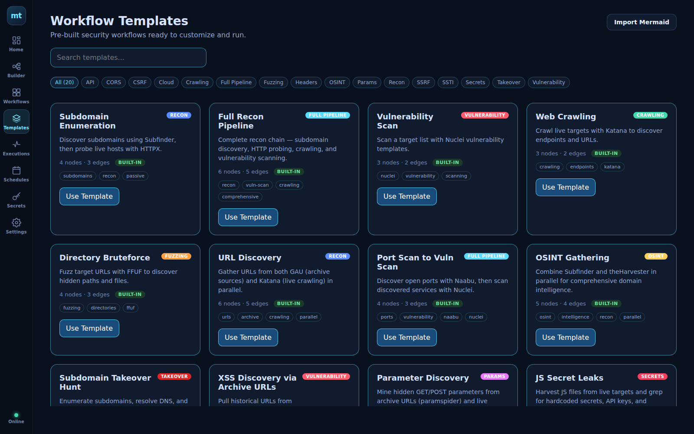
      <p align="center"><sub>Reusable recon and assessment graphs that can be cloned and modified rather than rewritten.</sub></p>
    </td>
  </tr>
  <tr>
    <td width="50%" valign="top">
      <h3 align="center">Schedules</h3>
      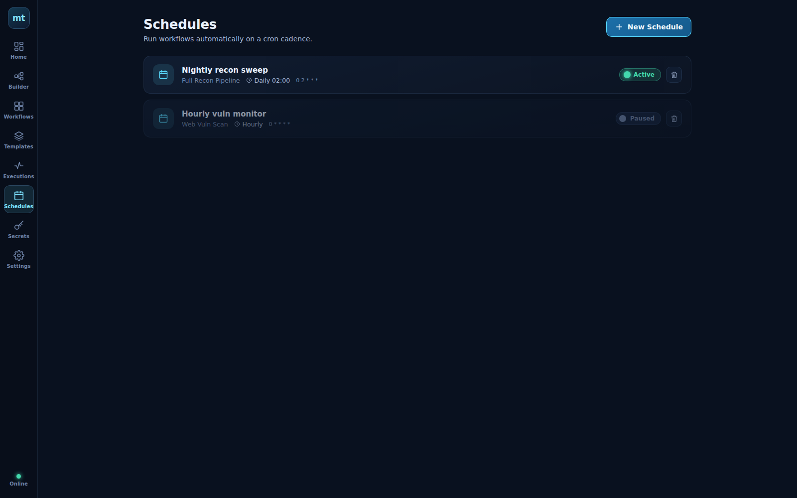
      <p align="center"><sub>Cron-driven workflows with enable/pause controls.</sub></p>
    </td>
    <td width="50%" valign="top">
      <h3 align="center">Mermaid import</h3>
      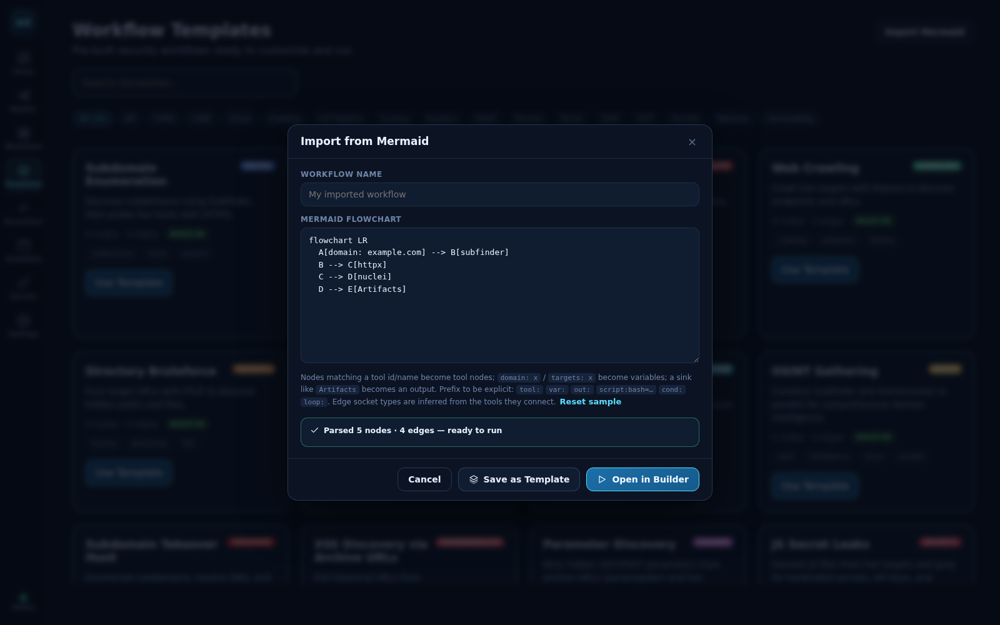
      <p align="center"><sub>Turn a Mermaid flowchart into a real typed workflow and export workflows back to Mermaid.</sub></p>
    </td>
  </tr>
</table>

## Download

Pre-built beta installers are published on the [GitHub Releases](https://github.com/MKlolbullen/mini-tricky/releases) page when a release is cut.

| Platform | Build formats |
| --- | --- |
| macOS | `.dmg`, `.zip` |
| Windows x64 | NSIS installer, portable `.exe` |
| Linux x64 | `.AppImage`, `.deb` |

Release builds bundle the Python runtime and backend dependencies. The external security tools themselves — for example `subfinder`, `httpx`, `nuclei`, `ffuf`, `katana`, and `nmap` — remain system tools and must be available on `PATH` when a workflow uses them.

Bootstrap supported tools with:

```bash
bash scripts/install-tools.sh
```

or use **Settings → Tool Manager → Copy install script** in the app.

> Beta installers are currently unsigned. Expect the normal macOS Gatekeeper / Windows SmartScreen warning for an unsigned application. Only install artifacts from this repository's release page and verify release provenance when available.

## Quick start

### Requirements for development

- Node.js 22 recommended (CI uses Node 22)
- Python 3.12 recommended (CI uses Python 3.12)
- npm
- the security binaries needed by the workflows you plan to run

### Clone and install

```bash
git clone https://github.com/MKlolbullen/mini-tricky.git
cd mini-tricky

npm ci
npm run frontend:install

cd backend
python3 -m venv .venv
source .venv/bin/activate
pip install -r requirements-dev.txt
cd ..
```

### Start the desktop development environment

```bash
npm run dev
```

This starts:

- FastAPI on `127.0.0.1:5000`;
- Vite on `127.0.0.1:5173`;
- Electron after the backend/frontend health checks pass.

### Browser-only mode

```bash
npm run web
```

Then open `http://127.0.0.1:5173`.

### Build installers

```bash
npm run desktop:build

# Platform-specific
npm run desktop:build:mac
npm run desktop:build:win
npm run desktop:build:linux
```

The release workflow builds each target on a native GitHub Actions runner and bundles a standalone Python runtime into the packaged backend.

## What you can build

mini-tricky is not just a launcher. The graph has explicit source, transformation, execution, control-flow, and sink semantics.

### Canonical recon chain

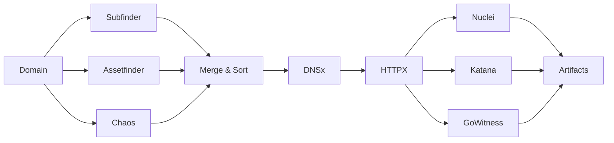
```mermaid
flowchart LR
    D[Domain] --> S[Subfinder]
    D --> A[Assetfinder]
    D --> C[Chaos]
    S --> M[Merge & Sort]
    A --> M
    C --> M
    M --> X[DNSx]
    X --> H[HTTPX]
    H --> N[Nuclei]
    H --> K[Katana]
    H --> W[GoWitness]
    N --> O[Artifacts]
    K --> O
    W --> O
```

### Deep injection workflow

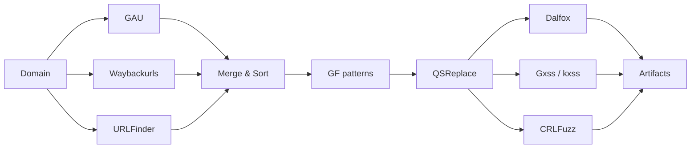
```mermaid
flowchart LR
    D[Domain] --> G[GAU]
    D --> W[Waybackurls]
    D --> U[URLFinder]
    G --> M[Merge & Sort]
    W --> M
    U --> M
    M --> F[GF patterns]
    F --> Q[QSReplace]
    Q --> DX[Dalfox]
    Q --> GX[Gxss / kxss]
    Q --> CR[CRLFuzz]
    DX --> O[Artifacts]
    GX --> O
    CR --> O
```

### Payload-driven fuzzing

A **Payload Set** source node can combine LFI, XSS, SQLi, RCE, SSRF, and SSTI payload lists and apply raw, URL, double-URL, Base64, or HTML encoding before feeding a wordlist-consuming tool.

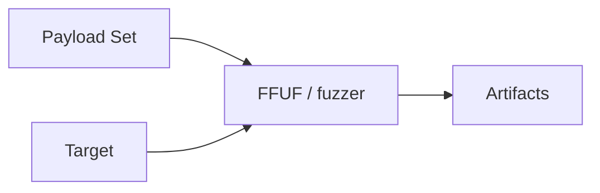
```mermaid
flowchart LR
    P[Payload Set] --> F[FFUF / fuzzer]
    T[Target] --> F
    F --> O[Artifacts]
```

Payload category names are allowlisted by the backend before file paths are constructed.

## Node model

| Node | Purpose | Typical inputs | Typical outputs |
| --- | --- | --- | --- |
| **Tool** | Execute an integrated CLI tool | tool-defined | tool-defined |
| **Variable** | Provide a domain, targets, URL, file, folder, or other value | — | typed value |
| **Payload Set** | Build an encoded payload wordlist | — | `wordlist` |
| **Merge & Sort** | Fan-in, concatenate, sort, and deduplicate upstream data | `any` | `targets` or `url` |
| **Script** | Inline Bash/Python transformation | `targets` | `targets` |
| **Condition** | Route data based on content | `targets` | `pass`, `fail` |
| **Loop** | Iterate line-by-line or by chunk | `targets` | `item` |
| **Module** | Embed a saved workflow as a reusable sub-workflow | `targets` | `targets` |
| **Output** | Collect terminal artifacts | `any` | — |

The validator rejects cycles, unknown tools, invalid socket contracts, and conflicting typed input occupancy. Merge/output fan-in is explicitly modeled instead of being smuggled through accidental shell behavior.

## Tool catalog

Tool definitions live in [`backend/tools.yaml`](backend/tools.yaml). The catalog covers areas including:

- passive and active reconnaissance;
- DNS and subdomain discovery;
- HTTP probing and technology fingerprinting;
- crawling and URL harvesting;
- parameter discovery;
- directory/content discovery;
- vulnerability and injection testing;
- API and GraphQL assessment;
- TLS/network scanning;
- screenshots;
- cloud and source security;
- secrets detection;
- OSINT provider queries;
- takeover, CORS, CSRF, SSRF, SSTI, JWT, and header checks;
- workflow utilities and transformations.

Recent expansion includes wide web-app assessment graphs, GraphQL tooling, JS-analysis tooling, source/cloud review, payload nodes, URL/file/folder socket types, and first-class merge/deduplication.

To add a tool, read [`CONTRIBUTING.md`](CONTRIBUTING.md). Tool definitions should expose real capabilities and typed contracts rather than becoming arbitrary shell-command wrappers.

## Execution model

A run is validated as a directed acyclic graph and executed in dependency order.

1. Validate node IDs, edges, socket contracts, and acyclicity.
2. Build parent/child indexes.
3. Queue nodes whose dependencies are satisfied.
4. Execute independent nodes concurrently up to the configured limit.
5. Stream node/log events over WebSocket.
6. Persist status and per-node artifacts.
7. Block dependent nodes when required parents fail.
8. Allow selected nodes to be replayed from cached upstream results.

This is deliberately closer to a small workflow engine than a shell-script visualizer.

## Architecture

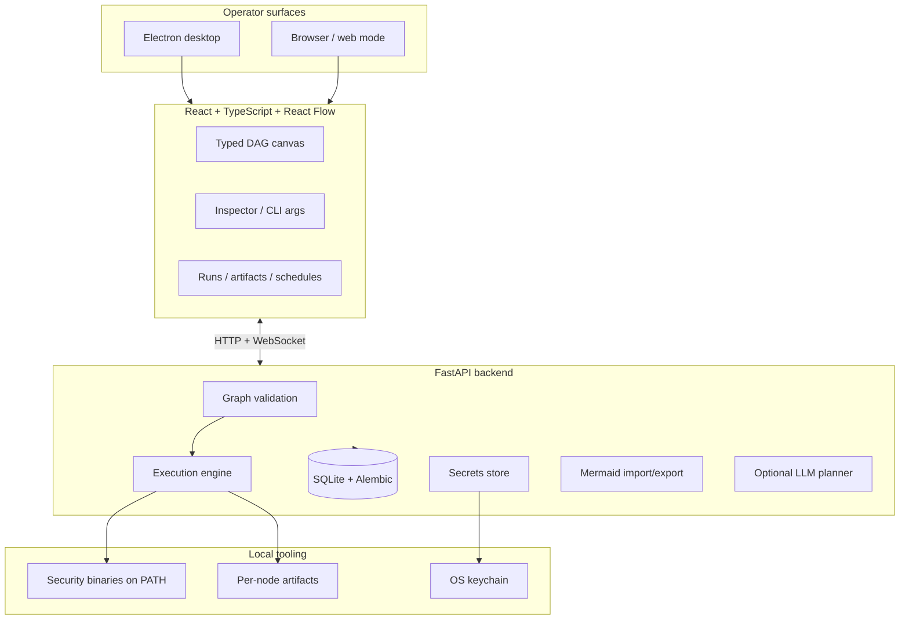
```mermaid
flowchart TB
    subgraph UI[Operator surfaces]
      E[Electron desktop]
      B[Browser / web mode]
    end

    subgraph FE[React + TypeScript + React Flow]
      C[Typed DAG canvas]
      I[Inspector / CLI args]
      R[Runs / artifacts / schedules]
    end

    subgraph BE[FastAPI backend]
      V[Graph validation]
      X[Execution engine]
      DB[(SQLite + Alembic)]
      S[Secrets store]
      M[Mermaid import/export]
      L[Optional LLM planner]
    end

    subgraph LOCAL[Local tooling]
      T[Security binaries on PATH]
      A[Per-node artifacts]
      K[OS keychain]
    end

    E --> FE
    B --> FE
    FE <-->|HTTP + WebSocket| BE
    V --> X
    X --> T
    X --> A
    BE --> DB
    S --> K
```

The Electron main process launches the backend, waits for `/api/health`, and then opens the UI. In packaged releases it prefers the bundled Python runtime; development mode uses the system Python interpreter.

## Persistence and artifacts

mini-tricky stores workflow state locally using SQLite/SQLModel with Alembic migrations. Runs keep per-node status and artifacts so operators can inspect exactly which stage produced which output.

The artifact browser supports common text formats and images. Artifact paths are treated as a trust boundary; path traversal protections belong in backend validation rather than in the UI.

## Secrets

Environment-profile secrets are split from the ordinary SQLite profile blob:

- macOS → Keychain;
- Windows → Credential Manager;
- Linux desktop → SecretService-compatible keyring;
- headless fallback → restricted local file permissions.

API responses mask sensitive values rather than returning plaintext credentials to the frontend.

## Mermaid ⇄ workflow

Mermaid import/export makes architecture documentation executable enough to be useful:

- labels matching known tools can become tool nodes;
- connections are converted into graph edges;
- compatible socket types are inferred;
- imported graphs receive a usable layout;
- existing workflows can be exported back to Mermaid for documentation or review.

Use this as an interchange/documentation feature, not as a substitute for reviewing what a workflow will actually execute.

## Security model

mini-tricky intentionally executes powerful local binaries, custom scripts, imported workflows, and security tooling. That makes its trust boundaries more important than in a normal dashboard application.

Security-sensitive areas include:

- Electron preload and IPC authorization;
- arbitrary filesystem access;
- local FastAPI/WebSocket exposure and origin handling;
- command/argument construction;
- imported workflow validation;
- custom script execution;
- secret storage and masking;
- artifact path handling;
- URLs passed to the operating system;
- release and dependency integrity.

Read [`SECURITY.md`](SECURITY.md) before reporting a vulnerability. Use mini-tricky only on systems and targets you are authorized to assess.

## API

FastAPI exposes interactive local API documentation while the backend is running:

```text
http://127.0.0.1:5000/docs
```

The API covers system/tool health, workflows and validation, runs and replay, artifacts, profiles/secrets, templates, schedules, presets, normalization, reports, Mermaid conversion, and optional workflow generation.

Keeping the endpoint-by-endpoint reference in generated FastAPI docs prevents the README from becoming a second API schema that quietly rots.

## Development

### Frontend

```bash
cd frontend
npm run lint
npm run test
npm run build

# UI smoke tests
npx playwright install chromium
npm run test:e2e
```

### Backend

```bash
cd backend
ruff check .
ruff format --check .
mypy src --ignore-missing-imports
pytest
```

### Metadata consistency

```bash
python scripts/sync_project_metadata.py --check
# or update marked metadata
python scripts/sync_project_metadata.py --write
```

### Pre-commit

```bash
pip install pre-commit
pre-commit install
pre-commit run --all-files
```

CI runs frontend lint/test/build and backend Ruff/mypy/pytest checks. Security-oriented GitHub workflows and browser smoke coverage are being expanded alongside the beta release process.

## Repository map

```text
mini-tricky/
├── backend/                 FastAPI orchestration engine, schemas, tools, templates, tests
├── frontend/                React/TypeScript/React Flow UI and Playwright smoke tests
├── electron/                Desktop process, preload bridge, menus, tray, backend lifecycle
├── payloads/                Allowlisted payload-set source data
├── scripts/                 Tool installer and project-maintenance scripts
├── build/                   Application icons and build resources
├── docs/                    Screenshots and extended documentation
├── .github/workflows/       CI and release automation
├── VERSION                  Canonical release version
├── SECURITY.md              Vulnerability-reporting policy
├── CONTRIBUTING.md          Development/tool/template contribution rules
└── README.md                You are here; congratulations on surviving the tree
```

## Roadmap

The highest-value next steps are less about blindly increasing the tool counter and more about improving orchestration quality:

- stronger Electron/local-API trust boundaries;
- code signing, release provenance, SBOMs, and update integrity;
- richer typed artifact contracts such as SBOMs;
- differential runs: scan what is new or changed instead of repeating everything;
- resource/rate budgets per node and per run;
- sandboxed execution options for selected tools;
- capability metadata so workflow generation can plan by **what a tool does**, not merely by its name;
- distributed workers for genuinely large engagements;
- additional cloud, exposure-intelligence, and software-supply-chain integrations.

## Contributing

PRs and issues are welcome. Good contributions improve capability, safety, composability, observability, or operator ergonomics.

See [`CONTRIBUTING.md`](CONTRIBUTING.md) for development commands and the tool/template contribution contract.

## Ethics

mini-tricky is intended for authorized penetration testing, bug bounty programs that permit the activity, lab/CTF environments, and defensive security research.

Do not use it against systems you do not have permission to assess. A visual graph does not magically make `--rate 100000` a governance strategy.

## License

[MIT](LICENSE)

## Acknowledgments

- [Trickest](https://trickest.com/) for inspiration around visual security workflow orchestration.
- [React Flow / XYFlow](https://reactflow.dev/) for the graph canvas foundation.
- [ProjectDiscovery](https://projectdiscovery.io/) and the broader open-source security-tool ecosystem.

<p align="center">
  <strong>Make the workflow explicit. Keep the evidence. Re-run only what deserves another packet.</strong>
</p>
