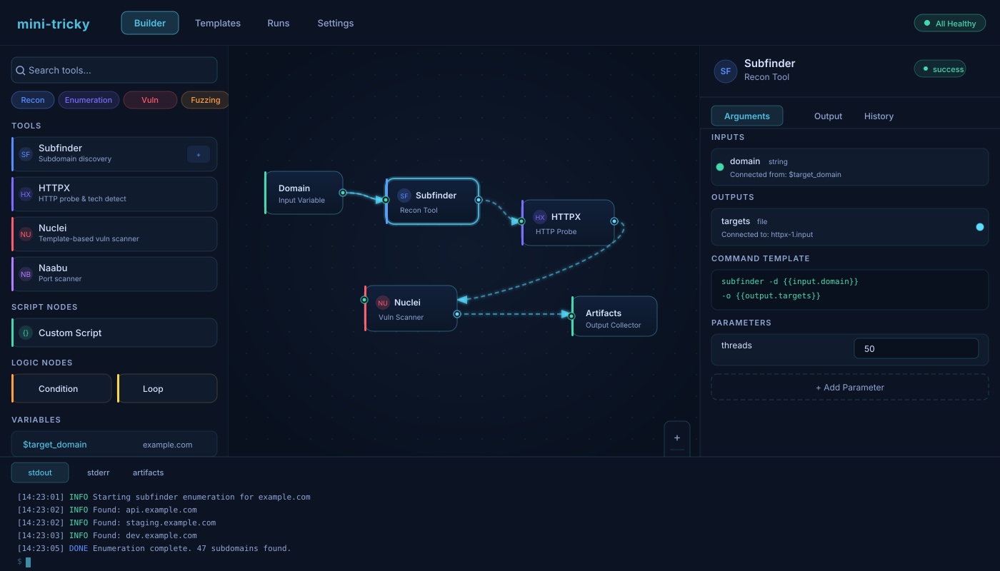
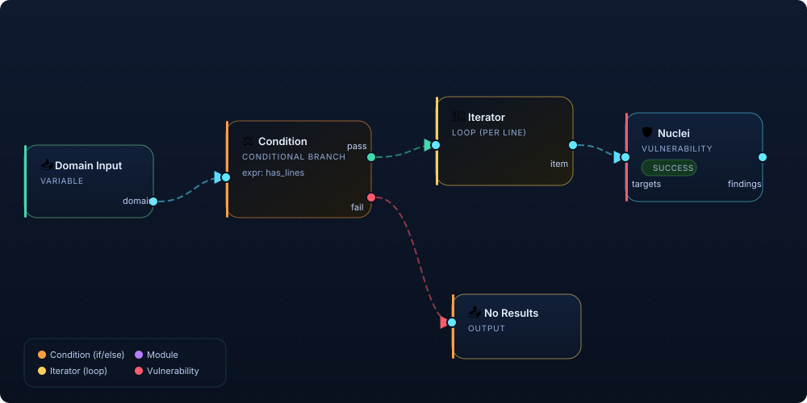
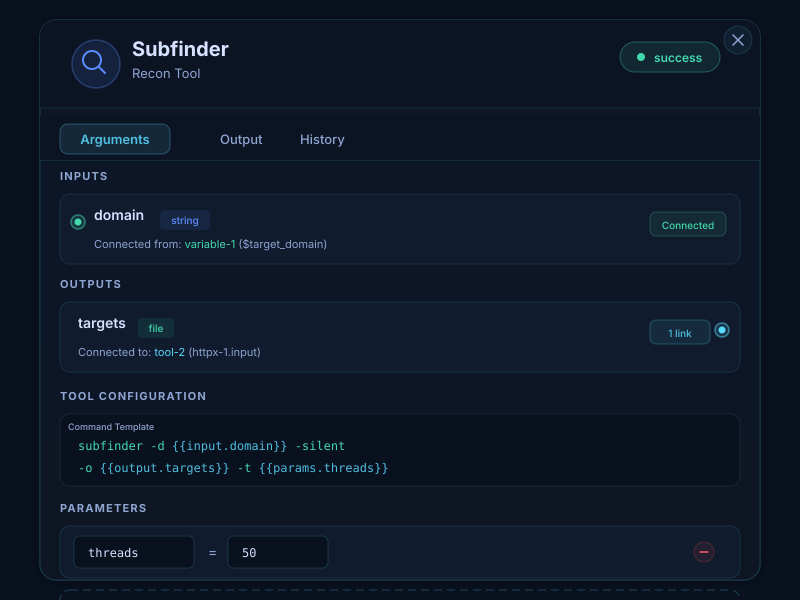
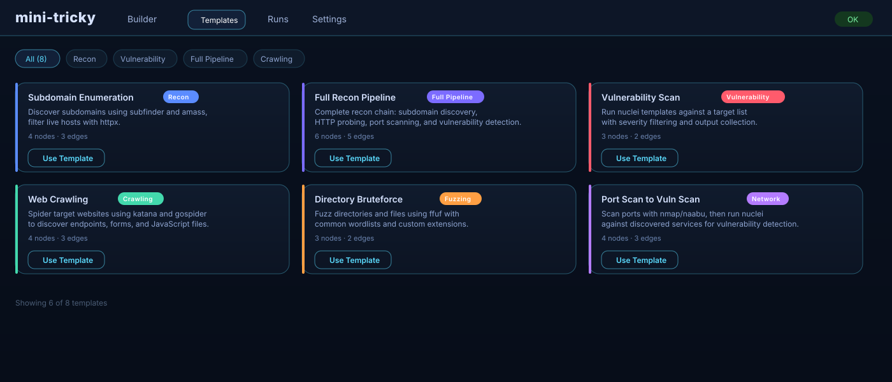

<h1 align="center">
  <br />
  mini-tricky
  <br />
</h1>

<p align="center">
  <strong>A locally hosted Trickest clone for security workflow automation.</strong>
  <br />
  Visual DAG editor &middot; 75 security tools &middot; 21 categories &middot; Real-time execution &middot; Zero cloud dependency
</p>

<p align="center">
  
  
  
  
  
  
  
</p>

<p align="center">
  <a href="#features">Features</a> &middot;
  <a href="#screenshots">Screenshots</a> &middot;
  <a href="#quick-start">Quick Start</a> &middot;
  <a href="#architecture">Architecture</a> &middot;
  <a href="#tool-library">Tool Library</a> &middot;
  <a href="#node-types">Node Types</a> &middot;
  <a href="#roadmap">Roadmap</a>
</p>

---

<p align="center">
  
</p>

---

## Download

Pre-built beta installers are published on the [**Releases page**](https://github.com/MKlolbullen/mini-tricky/releases):

| Platform | File |
|----------|------|
| macOS (Apple Silicon) | `mini-tricky-0.2.0-beta-mac-arm64.dmg` |
| Windows (x64) | `mini-tricky-0.2.0-beta-win-x64.exe` (NSIS installer) |
| Linux (x64) | `mini-tricky-0.2.0-beta.AppImage` / `mini-tricky-0.2.0-beta.deb` |

Installers **bundle a self-contained Python runtime** — no separate Python installation required. You still need the security tools themselves (`subfinder`, `nuclei`, `ffuf`, etc.) on your system `PATH`; mini-tricky ships the orchestration layer, not the tools.

> **Beta builds are unsigned.** On macOS right-click the `.app` → **Open** on first launch. On Windows click **More info** → **Run anyway** when SmartScreen warns. On Linux: `chmod +x mini-tricky-*.AppImage && ./mini-tricky-*.AppImage`.

---

## What is mini-tricky?

**mini-tricky** is a local-first desktop application (with optional web GUI mode) that replicates the Trickest workflow builder experience for offensive security automation. Build visual DAG workflows by dragging tools onto a canvas, connect them with typed sockets, and execute entire recon/scanning pipelines with real-time streaming output.

Ships as a **native Electron desktop app** for macOS / Windows / Linux with menus, tray, keyboard shortcuts, an embedded Python backend, and persisted window state — or run it as a **browser-only web GUI** if you prefer.

No cloud. No accounts. No subscriptions. Just your tools, your machine, your workflows.

### The problem it solves

Most bug bounty setups degrade into:
- Piles of one-off bash scripts with no reuse
- Terminal tabs multiplying faster than subdomains
- No clean way to model dependencies between tools
- Scattered notes, clipboard history, and half-finished pipelines
- Re-running entire chains because one tool failed

mini-tricky fixes this by giving you a **visual workflow engine** with typed data flow, parallel execution, per-node artifacts, and the ability to replay individual nodes without re-running the whole pipeline.

---

## Features

### Visual Workflow Builder
Drag security tools, variables, scripts, and logic nodes onto a React Flow canvas. Connect them with typed input/output sockets. The DAG engine validates connections and prevents invalid graphs (cycles, type mismatches, occupied sockets).

<p align="center">
  
</p>

### Trickest-Style Arguments Panel
The right sidebar is a structured node arguments controller — just like Trickest. Select any node to see its typed inputs/outputs with connection status indicators, configure parameters with add/remove fields, toggle script languages, and manage parameter presets.

<p align="center">
  
</p>

### Real-Time Execution
WebSocket streaming sends `node_started`, `node_finished`, and log events as they happen. Watch nodes light up on the canvas with state badges (queued/running/success/failed) and animated pulse borders. Fall back to HTTP batch execution if needed.

### 75 Integrated Security Tools
Pre-configured tools across **21 categories**, defined in `backend/tools.yaml` with command templates, typed I/O sockets, per-argument toggle switches, and timeout settings:

| Category | Tools |
|----------|-------|
| **Recon** | Subfinder, HTTPX, Amass, Assetfinder, Findomain, DNSx, ShuffleDNS, Chaos |
| **Enumeration** | Gobuster, Dirsearch, Feroxbuster, Wfuzz |
| **Vulnerability** | Nuclei, Nikto, WPScan, SQLMap, XSStrike, Dalfox |
| **Fuzzing** | FFUF |
| **Params** | Arjun, ParamSpider, x8, Paraminer |
| **Crawling** | Katana, GoSpider, Hakrawler, Waybackurls |
| **Network** | Nmap, Masscan, Naabu, RustScan |
| **OSINT** | theHarvester, Shodan CLI, Censys, SpiderFoot |
| **Archive** | GAU, Waymore |
| **API** | Kiterunner, APIFuzzer, OpenAPI Diff, RESTler |
| **SSRF** | SSRFmap, Gopherus, Interactsh, SSRF Sheriff |
| **SSTI** | SSTImap, Tplmap |
| **CSRF** | XSRFProbe |
| **CORS** | CORScanner, CRLFuzz |
| **Takeover** | Subjack, Subzy, Nuclei Takeover |
| **Headers** | Shcheck, Hakcheckurl |
| **JSAnalysis** | LinkFinder, SecretFinder, GetJS, SubJS |
| **Wordlist** | CeWL, Wordlister |
| **Cloud** | S3Scanner, Cloud Enum |
| **Secrets** | TruffleHog, Gitleaks |
| **Utility** | Anew, QSReplace, URO, Unfurl, JQ Filter, GF Patterns, Interlace, Rush, Notify, Meg |

### Trickest-Style Argument Toggle Switches
Each tool exposes its CLI flags as **typed argument toggles** in the right-hand inspector. Flip a `flag` switch on to include `-recursive`, set a `string` field for `-wordlist`, an `int` for `-threads`, a `float` for rate limits — the engine builds the final command from your toggles. Same UX as Trickest, fully local.

### Workflow Templates
8 built-in templates for common security workflows. Create and save your own custom templates.

<p align="center">
  
</p>

### Composable Sub-Workflows (Modules)
Package any saved workflow as a reusable module node. Drag it from the sidebar into another workflow — the backend expands and executes the sub-graph inline, piping data through automatically.

### Conditional Branching
Route data based on content with condition nodes. Supported expressions:
- `has_lines` / `empty` — check if upstream produced data
- `contains:PATTERN` / `not_contains:PATTERN` — string matching
- `line_count > N` / `min_lines:N` — threshold checks

Data flows to the **pass** or **fail** output socket based on evaluation.

### Loop/Iterator Nodes
Split upstream data for downstream processing:
- **Per Line**: Each line becomes a separate item
- **Per Chunk**: Split by blank lines (double newline)

### Custom Script Nodes
Write inline Bash or Python scripts with stdin/stdout piping. Upstream data flows in via stdin, script output flows downstream. Toggle between languages with one click.

### Cron Scheduling
Schedule workflows to run on cron expressions via APScheduler. Enable/disable schedules without deleting them.

### Workflow Versioning
Every save creates a numbered version snapshot. Browse version history in the inspector, compare node/edge counts, and restore any previous version with one click.

### Notifications
Toast notifications slide in on run completion, errors, and saves. Browser Notification API integration for background alerts when you're in another tab.

### Parameter Presets
Save frequently-used parameter configurations per tool. One-click apply from the arguments panel. Never re-type the same flags again.

### Artifact Explorer
Per-node artifact browsing with inline preview for text, JSON, HTML, and images. Download individual artifacts or open them in a new tab.

### Node Replay
Re-run any individual node using cached upstream outputs. No need to re-execute the entire workflow just because one tool needs a retry.

---

## Screenshots

### Workflow Builder
The main view: left sidebar with categorized tools, center canvas with connected workflow nodes, right sidebar with the Trickest-style arguments panel, and bottom console with live output.

<p align="center">
  
</p>

### Node Arguments Controller
Structured parameter editing with connection status indicators, typed socket fields, command templates, parameter presets, and version history.

<p align="center">
  
</p>

### Logic Nodes
Conditional branching and loop/iterator nodes enable complex workflow logic beyond simple linear chains.

<p align="center">
  
</p>

---

## Quick Start

### Prerequisites
- **Node.js** 18+ and npm
- **Python** 3.10+
- Security tools installed on your system `PATH` (subfinder, httpx, nuclei, ffuf, etc.)

### 1. Clone & install dependencies

```bash
git clone https://github.com/MKlolbullen/mini-tricky.git
cd mini-tricky

# Root deps (Electron, electron-builder, concurrently)
npm install

# Frontend deps
npm run frontend:install

# Backend deps (in a virtualenv)
cd backend
python3 -m venv .venv
source .venv/bin/activate
pip install -r requirements.txt
cd ..
```

### 1b. (Optional) Install the 75 security tools

mini-tricky ships the orchestration layer, not the tools. To bootstrap every
binary referenced in `backend/tools.yaml` in one go, run the generated
installer script:

```bash
bash scripts/install-tools.sh
```

The script is idempotent (every tool is guarded by `command -v`, so re-running
only installs what is still missing) and covers `go install`, `pip install`,
`cargo install`, `npm install -g`, `apt`, and `brew` flavours. You can also
fetch it fresh from a running backend — the same content is served by the
in-app **Tool Manager → Copy install script** button:

```bash
curl -s http://localhost:5000/api/tools/install-script > scripts/install-tools.sh
```

### 2. Run the desktop app (recommended)

```bash
npm run dev
```

This launches **everything** at once:
- FastAPI backend on `127.0.0.1:5000`
- Vite dev server on `127.0.0.1:5173`
- Electron window once both are healthy

When the Electron window opens you get full native menus (`Cmd/Ctrl+N` new workflow, `Cmd/Ctrl+S` save, `Cmd/Ctrl+R` run, `Cmd/Ctrl+1..4` switch views), system tray, and persisted window state.

### 3. Run as web GUI only (no Electron)

If you just want a browser-based experience:

```bash
npm run web
```

Then open `http://127.0.0.1:5173` in your browser. The backend at `127.0.0.1:5000` is started for you.

### 4. Build a production desktop installer

```bash
# All-in-one (current platform)
npm run desktop:build

# Platform-specific
npm run desktop:build:mac     # → dist-electron/*.dmg, *.zip
npm run desktop:build:win     # → dist-electron/*.exe, *.nsis
npm run desktop:build:linux   # → dist-electron/*.AppImage, *.deb
```

The installer bundles the frontend `dist/` and the entire `backend/` directory as `extraResources`, so end users only need Python 3.10+ on their system — no manual install of the app's Python deps.

App icons live in `build/` (`icon.svg` is the hand-authored source of truth, `icon.png` is the 1024×1024 master electron-builder consumes for macOS/Linux, `icon.ico` is the Windows multi-res icon). If you tweak the SVG, regenerate the PNG + ICO + tray-icon.png with:

```bash
pip install Pillow
python3 build/generate_icons.py
```

---

## Architecture

mini-tricky has **two run modes** that share the exact same backend and frontend code:

```
                ┌──────────────────────┐    ┌──────────────────────┐
                │  Desktop (Electron)  │    │   Web GUI (browser)  │
                │  npm run dev         │    │   npm run web        │
                └──────────┬───────────┘    └──────────┬───────────┘
                           │                            │
                           ▼                            ▼
┌─────────────────────────────────────────────────────────────────┐
│                React 18 + @xyflow/react (Vite)                   │
│  ┌──────────┬──────────────┬──────────────────────────────────┐ │
│  │  Tool    │   Canvas     │  Inspector / Arg Toggles         │ │
│  │  Sidebar │   (DAG)      │  (Trickest-style switches)       │ │
│  └──────────┴──────────────┴──────────────────────────────────┘ │
│  ┌──────────────────────────────────────────────────────────┐   │
│  │  Console (stdout / stderr / artifacts / live node states) │   │
│  └──────────────────────────────────────────────────────────┘   │
└─────────────────────────────────────────────────────────────────┘
                           │  HTTP + WebSocket
                           ▼
┌─────────────────────────────────────────────────────────────────┐
│                    FastAPI + Uvicorn Backend                     │
│  ┌────────┐ ┌──────────┐ ┌────────────────┐ ┌────────────────┐  │
│  │  Graph │ │ DAG Exec │ │ Artifact Mgr   │ │ Result         │  │
│  │  Valid │ │ Engine   │ │ + Preview      │ │ Normalizer     │  │
│  └────────┘ └──────────┘ └────────────────┘ └────────────────┘  │
│  ┌────────┐ ┌──────────┐ ┌────────────────┐ ┌────────────────┐  │
│  │ Sched. │ │ Version  │ │ Template/Preset│ │ Profile Store  │  │
│  │ (cron) │ │ Store    │ │ Manager        │ │ + Reports      │  │
│  └────────┘ └──────────┘ └────────────────┘ └────────────────┘  │
└─────────────────────────────────────────────────────────────────┘
                           │ subprocess
                           ▼
┌─────────────────────────────────────────────────────────────────┐
│              75 Local Security Tools (system PATH)               │
│  subfinder  httpx  nuclei  ffuf  katana  nmap  arjun  x8 ...    │
└─────────────────────────────────────────────────────────────────┘
```

In **desktop mode**, the Electron main process (`electron/main.cjs`) spawns the Python backend as a child process, polls `/api/health` until it's ready, then loads the Vite dev server (or the built `frontend/dist/index.html` in production). It also wires up native menus, the system tray, IPC handlers (`get-app-info`, `restart-backend`, `show-save-dialog`, `read-file`, `write-file`, ...), and persists window state to `userData/window-state.json`.

In **web mode**, you skip Electron entirely — `concurrently` runs the backend and Vite, and you point a browser at `http://127.0.0.1:5173`.

### Execution Model
- Workflows are validated as **Directed Acyclic Graphs (DAGs)**
- Nodes execute in **topological order** with parallel groups
- Parent nodes must complete before children start
- Independent nodes run concurrently (configurable worker count)
- Failed parents block downstream nodes cleanly
- Output data flows through typed sockets: `domain`, `targets`, `findings`, etc.

### Data Flow
```
Variable Node (domain: "example.com")
    │
    ▼ out:domain ──→ in:domain
Subfinder (produces targets.txt)
    │
    ▼ out:targets ──→ in:targets
HTTPX (filters live hosts)
    │
    ▼ out:targets ──→ in:targets
Nuclei (scans for vulnerabilities)
    │
    ▼ out:findings ──→ in:any
Output Node (collects artifacts)
```

---

## Node Types

| Node | Icon | Description | Inputs | Outputs |
|------|------|-------------|--------|---------|
| **Tool** | Category-specific | Runs a security tool via subprocess | Tool-defined | Tool-defined |
| **Variable** | 📥 | Provides input data (domain, target list, wordlist) | None | Typed value |
| **Output** | 📤 | Collects artifacts from upstream nodes | any | None |
| **Script** | 🐍/📜 | Custom Bash or Python with stdin/stdout piping | targets | targets |
| **Module** | 🧩 | Embeds a saved workflow as a sub-graph | targets | targets |
| **Condition** | ⚖️ | If/else branching based on data content | targets | pass, fail |
| **Loop** | 🔄 | Iterates over input line-by-line or chunk-by-chunk | targets | item |

---

## Project Structure

```
mini-tricky/
├── electron/                    # Electron main process + preload
│   ├── main.cjs                # Window/menus/tray/IPC/backend spawn
│   └── preload.cjs             # Secure contextBridge → window.miniTricky
├── backend/
│   ├── src/
│   │   └── main.py             # FastAPI app (all endpoints + execution engine)
│   ├── tools.yaml              # 75 tool definitions across 21 categories
│   ├── templates.yaml          # Built-in workflow templates
│   └── requirements.txt        # Python dependencies
├── frontend/
│   ├── src/
│   │   ├── App.tsx             # Root app with view routing
│   │   ├── api.ts              # All API + WebSocket helpers
│   │   ├── types.ts            # TypeScript type definitions
│   │   ├── index.css           # Full dark-theme stylesheet
│   │   └── components/
│   │       ├── TopBar.tsx      # Navigation bar
│   │       ├── builder/
│   │       │   ├── BuilderView.tsx    # Core builder logic
│   │       │   ├── Canvas.tsx         # React Flow wrapper
│   │       │   ├── SocketNode.tsx     # Custom node renderer
│   │       │   ├── ToolSidebar.tsx    # Draggable tool palette
│   │       │   ├── Inspector.tsx      # Arguments panel
│   │       │   ├── Toolbar.tsx        # Action buttons
│   │       │   ├── Console.tsx        # Output console
│   │       │   └── Notifications.tsx  # Toast notification system
│   │       ├── templates/
│   │       │   └── TemplatesView.tsx  # Template gallery
│   │       ├── runs/
│   │       │   ├── RunsView.tsx       # Run history table
│   │       │   └── RunDetail.tsx      # Run detail + artifacts
│   │       └── settings/
│   │           └── SettingsView.tsx   # Health + config
│   ├── index.html
│   ├── vite.config.ts
│   └── tsconfig.json
├── docs/images/                 # UI mockups and diagrams
└── package.json                 # Root package (Electron + electron-builder)
```

---

## API Reference

### System
| Method | Endpoint | Description |
|--------|----------|-------------|
| `GET` | `/api/health` | Backend health check (used by Electron auto-spawn) |
| `GET` | `/api/profiles` | List environment profiles (per target scope) |
| `POST` | `/api/profiles` | Create / update an environment profile |
| `POST` | `/api/generate` | AI-assisted workflow generation from a goal description |
| `POST` | `/api/normalize` | Normalize raw tool output into a unified findings schema |
| `GET` | `/api/runs/{id}/report` | Render Markdown / JSON report from a completed run |

### Workflows
| Method | Endpoint | Description |
|--------|----------|-------------|
| `GET` | `/api/workflows` | List all saved workflows |
| `POST` | `/api/workflows` | Save workflow (creates version) |
| `GET` | `/api/workflows/{id}` | Get workflow by ID |
| `GET` | `/api/workflows/{id}/versions` | List version history |
| `POST` | `/api/workflows/{id}/versions/{v}/restore` | Restore a version |
| `POST` | `/api/workflows/validate` | Validate graph structure |

### Runs
| Method | Endpoint | Description |
|--------|----------|-------------|
| `POST` | `/api/runs` | Execute workflow (HTTP batch) |
| `WS` | `/ws/run` | Execute workflow (WebSocket stream) |
| `GET` | `/api/runs` | List all runs |
| `GET` | `/api/runs/{id}` | Get run details |
| `DELETE` | `/api/runs/{id}` | Delete run + artifacts |
| `POST` | `/api/runs/{id}/cancel` | Cancel active run |
| `POST` | `/api/runs/{id}/replay/{node}` | Replay single node |

### Artifacts
| Method | Endpoint | Description |
|--------|----------|-------------|
| `GET` | `/api/runs/{id}/artifacts` | List run artifacts |
| `GET` | `/api/runs/{id}/artifact-preview?path=` | Preview artifact content |
| `GET` | `/api/runs/{id}/artifact-raw?path=` | Download raw artifact |

### Templates, Schedules, Presets
| Method | Endpoint | Description |
|--------|----------|-------------|
| `GET/POST` | `/api/templates` | List / create templates |
| `GET/POST/DELETE` | `/api/schedules` | Manage cron schedules |
| `PATCH` | `/api/schedules/{id}` | Toggle schedule enabled |
| `GET/POST/DELETE` | `/api/presets` | Manage parameter presets |

---

## Example Workflows

### Basic Recon Chain
```
Domain Input → Subfinder → HTTPX → Nuclei → Artifacts
```

### Conditional Vulnerability Scan
```
Domain Input → Subfinder → Condition (has_lines?)
    ├── pass → HTTPX → Nuclei → Artifacts
    └── fail → Output (no subdomains found)
```

### Parallel Discovery + Fuzzing
```
Domain Input ──┬── Gau ────────┬── Deduplicate → FFUF → Artifacts
               └── Katana ─────┘
```

### Sub-Workflow Module
```
Target List → [Full Recon Module] → Condition → Loop → Nuclei → Artifacts
```

---

## Tech Stack

| Layer | Technology | Purpose |
|-------|-----------|---------|
| Desktop Shell | Electron | Native app experience, file access |
| Frontend | React 18 + TypeScript | UI components |
| Graph Editor | @xyflow/react (React Flow) | Visual DAG canvas |
| Build Tool | Vite | Fast dev server + production builds |
| Backend | FastAPI + Uvicorn | REST API + WebSocket server |
| Execution | Python subprocess | Tool invocation + artifact capture |
| Scheduling | APScheduler | Cron-based workflow automation |
| Storage | JSON files | Workflows, runs, versions, presets |

---

## Roadmap

### Completed
- [x] Visual DAG workflow editor with drag-and-drop
- [x] **75 security tools across 21 categories** (Recon, Vuln, Params, API, SSRF, SSTI, CSRF, CORS, Takeover, Headers, JSAnalysis, Cloud, Secrets, Wordlist, etc.)
- [x] **Trickest-style argument toggle switches** (flag / string / int / float per CLI option)
- [x] **Color-coded typed sockets** (domain, targets, findings, params, urls, ...)
- [x] **Full Electron desktop app** with native menus, system tray, keyboard shortcuts, and persisted window state
- [x] **Embedded backend auto-spawn** in Electron with health-check polling
- [x] **Web GUI mode** (`npm run web`) as a no-Electron alternative
- [x] **Cross-platform installers** via electron-builder (`.dmg`, `.zip`, `.exe`, `.nsis`, `.AppImage`, `.deb`)
- [x] WebSocket streaming execution with live node states
- [x] Trickest-style node arguments panel / inspector
- [x] Conditional branching (if/else nodes)
- [x] Loop/iterator nodes (per-line, per-chunk)
- [x] Composable sub-workflow modules
- [x] Custom script nodes (Bash/Python)
- [x] Built-in workflow templates
- [x] Cron scheduling (APScheduler)
- [x] Workflow versioning with restore
- [x] Parameter presets
- [x] Environment profiles (per target scope)
- [x] Result normalization across tools
- [x] AI-assisted workflow generation (`/api/generate`)
- [x] Report export from run artifacts (`/api/runs/{id}/report`)
- [x] Toast + browser notifications
- [x] Animated directional edges
- [x] Category-colored minimap
- [x] Artifact explorer with inline preview
- [x] Node replay with cached upstream
- [x] Import/export workflows as JSON

### Planned
- [x] Per-tool install/bootstrap manager (auto-check `PATH` and offer install commands) — `scripts/install-tools.sh` + `GET /api/tools/install-script` + **Settings → Tool Manager → Copy install script**
- [ ] First **GitHub Releases beta** with one-click downloads for macOS / Windows / Linux
- [ ] Auto-update channel via electron-updater
- [ ] Dark/light theme toggle (currently dark-only)
- [ ] Distributed worker support for very large scans
- [ ] Per-run resource limits (CPU/RAM/network rate)

---

## Security & Ethics

This project is intended for:
- **Authorized penetration testing**
- **Bug bounty programs** where you have permission to test
- **Lab environments** and CTF challenges
- **Defensive security research**

Do not use this against targets you do not have explicit authorization to assess.

---

## Contributing

PRs, issues, and honest feedback welcome.

Good areas to contribute:
- Tool definitions in `tools.yaml` (add new tools)
- Node execution engine improvements
- React Flow UX polish
- Artifact rendering for more file types
- Electron desktop ergonomics

---

## License

MIT

---

## Acknowledgments

- [Trickest](https://trickest.com/) for the workflow builder inspiration
- [ProjectDiscovery](https://projectdiscovery.io/) and the offensive security tool ecosystem
- [React Flow / XYFlow](https://reactflow.dev/) for the graph rendering foundation
- Everyone tired of terminal chaos who wants a better operator surface

---

<p align="center">
  <strong>Built for local workflows, real tooling, and less operational mess.</strong>
</p>
