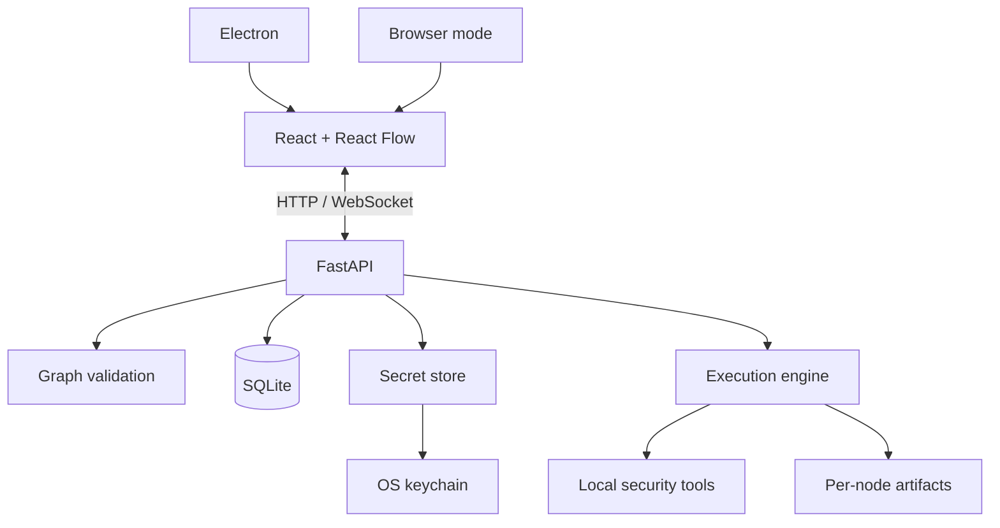

# mini-tricky documentation

This directory contains extended project documentation and screenshots. The top-level [`README.md`](../README.md) is the operator-facing overview; this file points contributors to the actual sources of truth so project documentation does not become a second, stale implementation.

## Sources of truth

| Subject | Source |
| --- | --- |
| Release version | [`VERSION`](../VERSION) |
| Tool catalog | [`backend/tools.yaml`](../backend/tools.yaml) |
| Built-in templates | [`backend/templates.yaml`](../backend/templates.yaml) |
| Backend API/schema | [`backend/src/main.py`](../backend/src/main.py) and live FastAPI `/docs` |
| Persistence/schema | [`backend/src/db.py`](../backend/src/db.py), `backend/alembic/` |
| Secrets behavior | [`backend/src/secrets_store.py`](../backend/src/secrets_store.py) |
| Mermaid conversion | [`backend/src/mermaid.py`](../backend/src/mermaid.py) |
| Optional workflow generation | [`backend/src/llm.py`](../backend/src/llm.py) |
| Frontend contracts | [`frontend/src/types.ts`](../frontend/src/types.ts) |
| Frontend API client | [`frontend/src/api.ts`](../frontend/src/api.ts) |
| Electron trust boundary | [`electron/main.cjs`](../electron/main.cjs), [`electron/preload.cjs`](../electron/preload.cjs) |
| Release packaging | [`package.json`](../package.json), [`.github/workflows/release.yml`](../.github/workflows/release.yml) |
| Contribution rules | [`CONTRIBUTING.md`](../CONTRIBUTING.md) |
| Vulnerability reporting | [`SECURITY.md`](../SECURITY.md) |

Tool/template counts and marked README/release metadata are synchronized with:

```bash
python scripts/sync_project_metadata.py --write
```

CI runs the same script with `--check`.

## System architecture

mini-tricky has three major runtime layers:

1. **Electron desktop shell** — application lifecycle, native menus/tray, file dialogs, IPC bridge, and backend process management.
2. **React/TypeScript frontend** — application shell, React Flow DAG editor, node inspector, templates, execution views, schedules, profiles, secrets UI, and artifact browsing.
3. **FastAPI backend** — graph validation, execution, persistence, scheduling, artifacts, replay, normalization, Mermaid import/export, secret split-storage, and optional workflow generation.

The core desktop application runs locally. External security tools and explicitly configured provider integrations can make network requests as part of an authorized workflow.



## Workflow model

A workflow is a directed acyclic graph of typed nodes. Important node families include:

- **Tool nodes** — run a catalogued CLI integration with typed inputs/outputs and argument controls.
- **Variable nodes** — provide typed source values.
- **Payload Set nodes** — generate allowlisted, optionally encoded wordlists.
- **Merge & Sort nodes** — first-class fan-in, concatenation, sorting, and deduplication.
- **Script nodes** — local Bash/Python transformations.
- **Condition nodes** — route based on output content.
- **Loop nodes** — iterate input by line/chunk.
- **Module nodes** — embed reusable saved workflows.
- **Output nodes** — collect terminal artifacts.

The backend owns graph validation and execution semantics. The UI should help construct valid graphs but must not be treated as the security boundary.

## API documentation

When the backend is running, the authoritative interactive API reference is generated by FastAPI:

```text
http://127.0.0.1:5000/docs
```

This is preferred over maintaining a hand-written endpoint inventory here because route signatures evolve with the implementation.

## Tool authoring

See [`CONTRIBUTING.md`](../CONTRIBUTING.md) for the integration checklist. A high-quality tool definition should have:

- a verified upstream project and license;
- reproducible install guidance;
- a stable executable name;
- a meaningful category;
- typed input/output contracts;
- real CLI flags mapped to inspector controls;
- safe defaults and a realistic timeout;
- documented secrets/runtime/platform requirements;
- validation coverage where behavior changes.

The goal is capability composition, not maximizing a vanity counter.

## Template authoring

Templates should model the real data flow explicitly. In particular:

- do not hard-code assessment targets;
- use typed sockets correctly;
- model fan-in with Merge & Sort rather than accidental multiple writers;
- preserve useful artifacts at stage boundaries;
- make parallel branches intentional;
- keep defaults appropriate for authorized assessment workflows;
- validate every built-in template through the backend graph validator.

## Security architecture

mini-tricky executes powerful local processes and accepts workflow/configuration input, so several boundaries deserve explicit review:

- renderer ↔ Electron preload/IPC;
- renderer ↔ localhost HTTP/WebSocket API;
- backend ↔ local filesystem;
- backend ↔ subprocess arguments/environment;
- profile database ↔ OS keychain;
- imported workflow ↔ execution engine;
- artifact paths ↔ preview/download handlers;
- URLs ↔ operating-system external-open behavior;
- source repository ↔ packaged release artifacts.

Security-sensitive reports should follow [`SECURITY.md`](../SECURITY.md).

## Testing

Backend:

```bash
cd backend
ruff check .
ruff format --check .
mypy src --ignore-missing-imports
pytest
```

Frontend:

```bash
cd frontend
npm run lint
npm run test
npm run build
npx playwright install chromium
npm run test:e2e
```

Playwright launches the real backend and frontend defined in `frontend/playwright.config.ts` so smoke coverage exercises current navigation and catalog loading.

## Release model

Desktop releases are built by `.github/workflows/release.yml` on native macOS, Windows, and Linux runners. The workflow:

1. installs Node/frontend dependencies;
2. downloads a standalone Python runtime;
3. installs backend runtime dependencies into that bundle;
4. packages platform artifacts with electron-builder;
5. creates build-provenance attestations;
6. publishes the artifacts through a GitHub prerelease.

The external security binaries referenced by workflow nodes are intentionally not bundled into the application package.

## Screenshots

The images under [`docs/screenshots/`](screenshots/) are used by the top-level README. When substantial UI navigation changes, update both the relevant screenshots and any Playwright smoke paths that depend on that navigation.

## Design direction

The project benefits more from richer orchestration semantics than from indefinitely adding wrappers. High-value directions include:

- capability metadata for planner/tool selection;
- differential runs and state-aware recon;
- typed artifacts such as SBOMs;
- resource/rate budgets;
- stronger local API and Electron trust boundaries;
- sandboxed execution options;
- release signing/provenance/SBOM improvements;
- distributed workers for engagements that actually require them.
