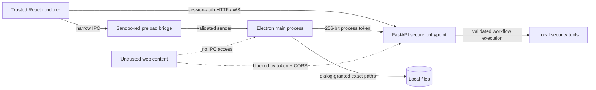

# Runtime Security Model

mini-tricky is local-first, but **localhost is not a trust boundary by itself**. A malicious web page can often send requests to services bound to loopback, and an Electron renderer should not automatically receive unrestricted filesystem or process-adjacent capabilities.

This document describes the desktop/web trust model implemented around the application runtime.

## Trust boundaries

## Local API authentication

Electron creates a fresh random 256-bit session token for each application process. The token is:

- passed to the backend through `MINI_TRICKY_SESSION_TOKEN`;
- exposed only to the trusted renderer through the preload bridge;
- sent as `X-Mini-Tricky-Token` on normal HTTP API requests;
- sent as the `mt_token` query parameter only where browser APIs cannot attach headers (WebSockets and direct download URLs);
- compared with `secrets.compare_digest` by the backend;
- never persisted as application state.

When the token environment variable is absent, authentication is disabled for browser-only development mode. CORS remains restricted to local development origins.

## CORS

The secure backend entrypoint removes the historical wildcard CORS layer and accepts only:

- `http://127.0.0.1:5173`
- `http://localhost:5173`
- the packaged Electron `file://` origin (`Origin: null`)

Additional origins can be supplied deliberately through `MINI_TRICKY_ALLOWED_ORIGINS`.

CORS is the outer middleware so browser preflight requests can negotiate the custom session-token header before authenticated application traffic is evaluated.

## Electron renderer isolation

Desktop windows use:

- `contextIsolation: true`
- `nodeIntegration: false`
- `sandbox: true`
- `webviewTag: false`

The renderer receives a narrow `contextBridge` API instead of Node.js or Electron objects.

IPC handlers verify that messages originate from the expected Vite origin in development or the packaged `file://` renderer in production.

## Filesystem access

Renderer-controlled paths are not accepted as ambient authority.

A path must first be returned by a native Electron open/save dialog. The main process records the exact resolved path and only permits `read-file` / `write-file` IPC against those dialog-granted paths. Text IPC is capped at 25 MiB.

This turns filesystem access into a user-granted capability rather than an arbitrary path primitive.

## Navigation and external URLs

Unexpected top-level renderer navigation is blocked. Renderer-created external windows are denied by default; only explicitly allowlisted HTTPS hosts are delegated to the operating system browser.

Trusted application-menu actions may still open known local/API documentation and repository links directly from the main process.

## Content Security Policy

Packaged Electron responses receive a restrictive CSP intended to prevent remote script/object execution and constrain network connections to the local backend. Development mode does not inject the production CSP because Vite HMR requires a different policy.

Any new frontend runtime that requires workers, remote assets, frames, or additional network destinations should update the CSP deliberately and include a regression test where practical.

## Remaining risks

The session token protects the loopback service from unrelated web origins, but it is not designed to defend against arbitrary code already executing inside the trusted renderer. Renderer XSS therefore remains security-sensitive.

Tool execution is also intentionally powerful. Workflow scope controls, command construction, custom-script behavior, imported workflows, and third-party tool binaries remain separate security surfaces and should continue to receive focused validation.
